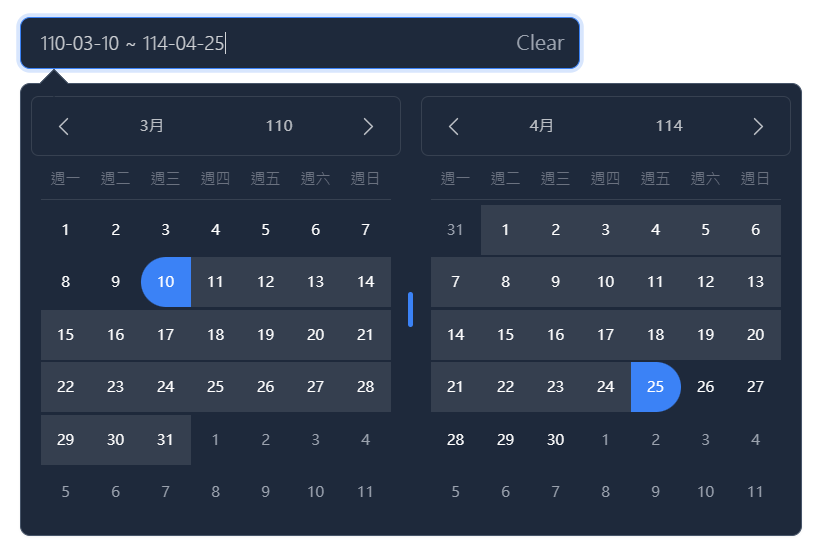

# React Tailwindcss Datepicker with 民國年

<p align="center">
    <a href="https://react-tailwindcss-datepicker.vercel.app/" target="_blank">
      
    </a><br><br>
    A modern date range picker component for React using Tailwind 3 and dayjs. Alternative to Litepie Datepicker which uses Vuejs.
</p>

<div align="center">
    
[](https://www.npmjs.com/package/react-tailwindcss-datepicker)
[](https://www.npmjs.com/package/react-tailwindcss-datepicker)
    
</div>

## 民國年 Edition

此 Datepicker 使用民國年顯示。本套件內部仍然使用西元年來處理日期，因此無論是設定`onChange`或是`minDate`等等的參數請依舊使用西元年作業。




## 安裝
```shell
npm install "https://github.com/benebsiny/react-tailwindcss-datepicker-roc-year/releases/download/v1.7.3-fork.3/rtd-roc-year-1.7.3-fork.3.tgz"
```

## Tailwindcss 設定檔
```javascript
// in your tailwind.config.js
module.exports = {
    // ...
    content: [
        "./src/**/*.{js,jsx,ts,tsx}",
        "./node_modules/react-tailwindcss-datepicker-roc-year/dist/index.esm.js"
    ]
    // ...
};
```

---

## Contents

-   [Features](#features)
-   [Documentation](#documentation)
-   [Installation](#installation)
-   [Simple Usage](#simple-usage)
-   [Theming Options](#theming-options)
-   [Playground](#playground)
-   [Contributing](#contributing)

## Features

-   ✅ Theming options
-   ✅ Dark mode
-   ✅ Single Date
-   ✅ Single date use Range
-   ✅ Shortcuts
-   ✅ TypeScript support
-   ✅ Localization(i18n)
-   ✅ Date formatting
-   ✅ Disable specific dates
-   ✅ Minimum Date and Maximum Date
-   ✅ Custom shortcuts

## Documentation

Go to [full documentation](https://react-tailwindcss-datepicker.vercel.app/)

## Installation

⚠️ React Tailwindcss Datepicker uses Tailwind CSS 3 (with the
[@tailwindcss/forms](https://github.com/tailwindlabs/tailwindcss-forms) plugin) &
[Dayjs](https://day.js.org/en/) under the hood to work.

### Install via npm

```
npm install react-tailwindcss-datepicker
```

### Install via yarn

```
yarn add react-tailwindcss-datepicker
```

Make sure you have installed the peer dependencies as well with the below versions.

```
"dayjs": "^1.11.6",
"react": "^17.0.2 || ^18.2.0"
```

## Simple Usage

#### Tailwindcss Configuration

Add the datepicker to your tailwind configuration using this code

```javascript
// in your tailwind.config.js
module.exports = {
    // ...
    content: [
        "./src/**/*.{js,jsx,ts,tsx}",
        "./node_modules/react-tailwindcss-datepicker/dist/index.esm.js"
    ]
    // ...
};
```

Then use react-tailwindcss-select in your app:

```tsx
import { useState } from "react";
import Datepicker from "react-tailwindcss-datepicker";

const App = () => {
    const [value, setValue] = useState({
        startDate: null,
        endDate: null
    });

    return (
        <>
            <Datepicker value={value} onChange={newValue => setValue(newValue)} />
        </>
    );
};

export default App;
```

## Theming options

**Light Mode**


**Dark Mode**


**Supported themes**


**Teal themes example**


You can find the demo at [here](https://react-tailwindcss-datepicker.vercel.app/demo)

> **Info**
>
> 👉 To discover the other possibilities offered by this library, you can consult the
> [full documentation](https://react-tailwindcss-datepicker.vercel.app/).

## PlayGround

Clone the `master` branch and run commands:

```sh
# Using npm
npm install && npm dev

# Using yarn
yarn install && yarn dev

```

Open a browser and navigate to `http://localhost:8888`

## Contributing

See
[CONTRIBUTING.md](https://github.com/onesine/react-tailwindcss-datepicker/blob/master/CONTRIBUTING.md)

## Official Documentation repo

[https://github.com/onesine/react-tailwindcss-datepicker-doc](https://github.com/onesine/react-tailwindcss-datepicker-doc)

## Thanks to

-   [Vue Tailwind Datepicker](https://vue-tailwind-datepicker.com/)
-   [React](https://reactjs.org/)
-   [Tailwind CSS](https://tailwindcss.com/)
-   [dayjs](https://day.js.org/)

I thank you in advance for your contribution to this project.

## License

[MIT](LICENSE) Licensed. Copyright (c) Lewhe Onesine 2022.
